# Manual de usuario de KITE Local

### KML Interactive Tree Explorer — versión 202609142245

Este manual da por hecho que KITE Local ya está desplegado y abierto en el navegador (como archivo local con doble clic, o servido desde una dirección web): no trata la instalación, sino el manejo diario de la aplicación. Todas las capturas de este documento corresponden a una sesión de ejemplo con datos ficticios (una zona de operación y unos sensores cerca de Madrid), usada solo para ilustrar cada función.

---

## Índice

1. [Idea general y estructura de la ventana](#1-idea-general-y-estructura-de-la-ventana)
2. [El panel de navegación](#2-el-panel-de-navegación)
3. [El árbol de capas](#3-el-árbol-de-capas)
4. [El panel del visor (el mapa)](#4-el-panel-del-visor-el-mapa)
5. [El menú contextual del visor](#5-el-menú-contextual-del-visor)
6. [Estilos de capa](#6-estilos-de-capa)
7. [Cómo hacer las tareas más habituales](#7-cómo-hacer-las-tareas-más-habituales)
8. [Atajos de teclado](#8-atajos-de-teclado)
9. [Qué se guarda y dónde](#9-qué-se-guarda-y-dónde)

---

## 1. Idea general y estructura de la ventana

KITE Local reparte la pantalla en dos zonas, separadas por una barra que se puede arrastrar para darle más sitio a una u otra:

- **El panel de navegación**, a la izquierda: el árbol de capas cargadas, con sus carpetas, y todos los controles para buscar, importar, ordenar y organizar esa información.
- **El panel del visor**, a la derecha: el mapa, con la cartografía de fondo y todas las capas que estén activas.

Un botón con una flecha (◀ / ▶), en el borde entre ambos, oculta o vuelve a mostrar el panel de navegación por completo, para quien quiera ver el mapa a pantalla completa un momento sin perder lo cargado.

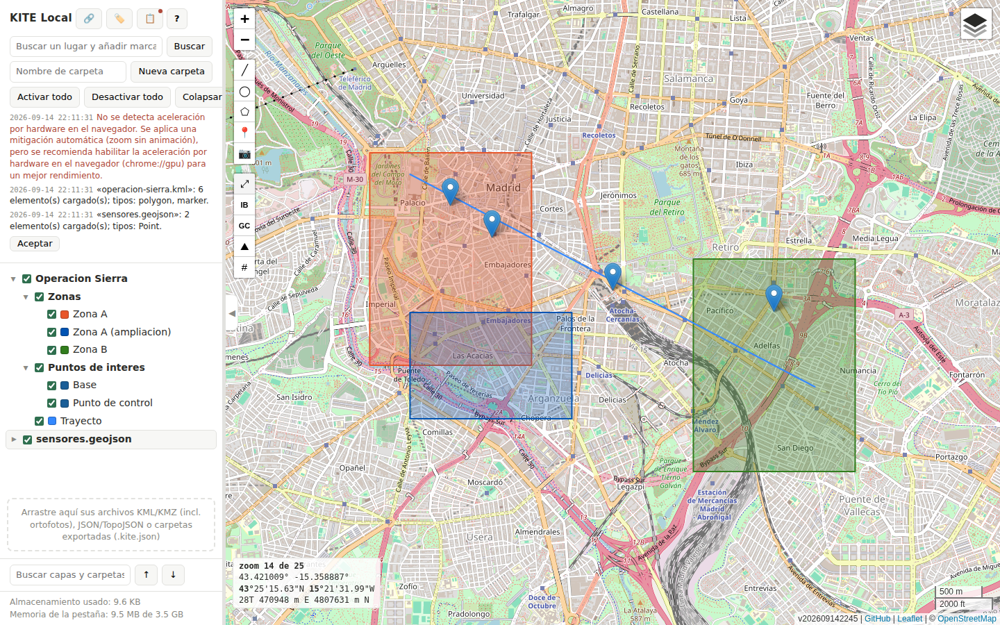
*Figura 1. Vista general: panel de navegación (árbol con dos zonas, dos puntos de interés y una capa de sensores) y visor con la cartografía de fondo.*

Una idea recorre toda la aplicación: **la vista del mapa es del usuario y nadie la toca sin que se pida**. Cargar un archivo nuevo, por grande que sea, no mueve el encuadre ni cambia el zoom; para eso están los botones de encuadre que se describen más adelante. Del mismo modo, ningún diálogo aplica un cambio hasta que se pulsa «Aceptar»: se puede abrir el estilo de una capa, probar colores y tamaños, y cerrar con «Cancelar» sin que nada de lo probado llegue a aplicarse.

---

## 2. El panel de navegación

### 2.1 Cabecera

En la parte superior están el título de la aplicación y cuatro botones de alcance general, además del buscador de lugares y los controles de carpetas.

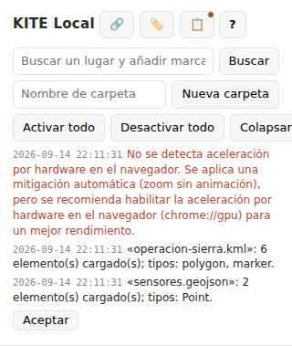
*Figura 2. Cabecera del panel: botones generales, buscador de lugares, creación de carpetas y los tres botones de activación masiva. Debajo, el aviso de la última carga.*

- **🔗 Añadir desde una dirección**: descarga un archivo desde una dirección web y lo incorpora, con el mismo tratamiento que si se hubiera arrastrado desde el disco. Se explica con detalle en el apartado 7.
- **🏷️ Nombres recordados para GeoJSON**: abre un editor de las asociaciones que la aplicación recuerda entre la forma de un archivo GeoJSON (qué claves trae) y la propiedad que se usa como nombre de cada elemento. Permite revisar, cambiar o borrar esas asociaciones.
- **📋 Registro de avisos**: abre el historial completo de avisos de la sesión en curso —cargas, advertencias, confirmaciones—, incluidos los que ya han desaparecido solos del panel. Un punto sobre el botón indica que hay avisos nuevos sin leer.
- **? Ayuda**: abre la chuleta de atajos de teclado (apartado 8), la misma que se abre con la tecla `?`.
- **Buscar un lugar y añadir marcador…**: un buscador de topónimos apoyado en el servicio Nominatim de OpenStreetMap. Se consulta solo al pulsar «Buscar» o la tecla Intro, nunca mientras se escribe. Los resultados aparecen debajo, dentro de la propia cabecera —empujando el árbol hacia abajo, no flotando encima— y se cierran con su «×»; elegir uno crea un marcador en una carpeta «Lugares» y centra la vista sobre él.
- **Nombre de carpeta / Nueva carpeta**: crea una carpeta vacía en el árbol, lista para arrastrar capas dentro o para servir de destino de una importación.
- **Activar todo / Desactivar todo / Colapsar todo**: actúan sobre el árbol completo. Activar y desactivar cambian de golpe la visibilidad de todas las capas; colapsar cierra todas las carpetas.

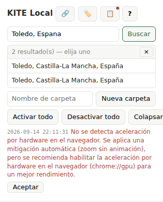
*Figura 3. El buscador de lugares, con sus resultados desplegados dentro de la propia cabecera.*

Justo debajo aparecen los avisos de la sesión (en el color normal del texto si son solo información, en rojo si señalan un problema), con fecha y hora completas; uno que se repite no añade una línea nueva, funde con la anterior y la marca con un contador (×N). Un resumen de importación se queda fijo en pantalla hasta que se pulsa «Aceptar», precisamente para dar tiempo a leer qué se cargó y qué no. El botón 📋 de la cabecera abre el mismo historial completo, con todo lo ocurrido en la sesión aunque ya haya desaparecido del panel.

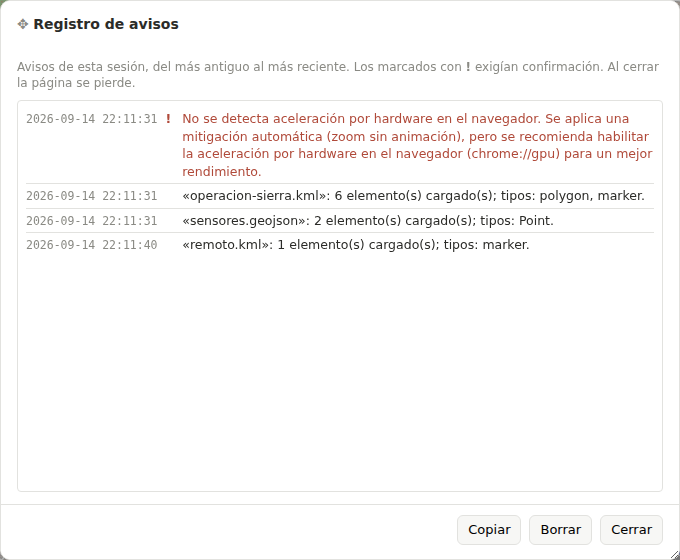
*Figura 4. Registro de avisos: todo lo ocurrido en la sesión, del más antiguo al más reciente, con los que exigían confirmación marcados con «!».*

### 2.2 Zona para soltar archivos

Debajo del árbol hay una franja que indica qué se puede soltar ahí: archivos KML y KMZ (incluidas las ortofotos que traiga incrustadas), JSON, GeoJSON y TopoJSON, o una carpeta previamente exportada por la propia aplicación (extensión «.kite.json»). Arrastrar cualquiera de esos archivos desde el escritorio y soltarlo sobre el panel —o sobre una carpeta concreta del árbol, para importar dentro de ella— es la vía más directa de cargar información.

### 2.3 Buscador del árbol

Al pie del panel hay un segundo buscador, distinto del de lugares: busca por nombre entre las capas y carpetas ya cargadas, en vivo mientras se escribe (a partir de tres letras, para no recorrer árboles grandes en cada pulsación). Las flechas ↑ / ↓ de su lado saltan a la ocurrencia anterior o siguiente, y un contador indica cuántas hay.

### 2.4 Pie del panel

Al final del todo, dos cifras: cuánto ocupa en disco lo guardado por la aplicación y cuánta memoria está usando la pestaña del navegador. Cualquiera de las dos desaparece sola cuando no hay un dato fiable que mostrar (por ejemplo, la memoria no puede medirse al abrir la aplicación con doble clic desde el disco, solo cuando se sirve desde una dirección web).

---

## 3. El árbol de capas

El árbol es el inventario de todo lo cargado: cada archivo, carpeta, capa, medición o cuadrícula de elevación es una fila. Refleja fielmente la estructura del archivo de origen: un KML vuelca sus carpetas tal cual las traía, y un GeoJSON —que no tiene jerarquía propia— se agrupa dentro de una carpeta con el nombre del archivo.

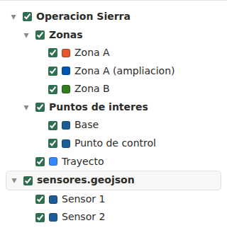
*Figura 5. Estructura del árbol: dos carpetas del KML importado («Zonas» y «Puntos de interés»), una capa de línea suelta y, más abajo, la carpeta que agrupa un GeoJSON importado.*

### 3.1 Qué lleva cada fila

- Una flecha (▾ / ▸) para desplegar o colapsar, solo en carpetas y archivos.
- Una casilla que activa o desactiva la capa en el mapa. Es la única que decide la visibilidad: la casilla de una carpeta es un interruptor masivo para todo lo de dentro, nunca un filtro por sí sola.
- Un cuadradito de color, en las capas que lo tienen, con el color con el que se dibuja.
- El nombre. Un clic sobre el nombre selecciona la fila; para renombrar hace falta `F2` o el diálogo de propiedades (apartado 8), no un doble clic sobre el texto.
- Unos botones de acción, que solo aparecen al pasar el ratón por encima de la fila (para no ocupar sitio permanentemente) y cambian según el tipo de nodo.

### 3.2 Los tres estados de una casilla

La casilla de una carpeta o un archivo puede estar marcada, sin marcar o **indeterminada** —un guion, no un cuadrado— cuando parte de lo que contiene está activo y parte no. Es el mismo indicador que usa cualquier gestor de archivos para una selección mixta.

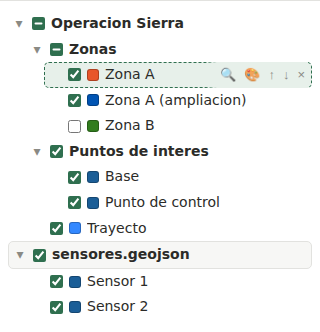
*Figura 6. La carpeta «Zonas» y la carpeta raíz quedan en su tercer estado (guion) al haber desactivado solo «Zona B».*

### 3.3 Botones de acción por tipo de fila

Al pasar el ratón por una fila aparecen, según lo que sea:

- **En una carpeta o un archivo**: seleccionar todas sus capas (☑) o quitar la selección (☐), ordenar alfabéticamente (AZ, que alterna ascendente y descendente), colapsar la carpeta y todas las de dentro, y guardarla en un archivo aparte (💾).
- **En una capa**: centrar la vista y acercar el zoom a un nivel fijo (🔍), y abrir su diálogo de estilos (🎨).
- **Si la capa tiene una ficha o propiedades que enseñar**: un botón adicional (ℹ) para verlas.
- **En cualquier fila**: subir (↑) y bajar (↓) un puesto entre sus hermanas, y borrar (×).

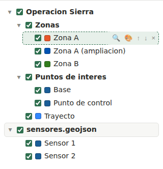
*Figura 7. La fila «Zona A», seleccionada (borde discontinuo) y con el ratón encima: aparecen sus botones de enfoque, estilo, subir/bajar y borrar. No tiene botón ℹ porque este polígono no trae ninguna ficha.*

### 3.4 Selección múltiple

Adem del clic normal (que selecciona una única fila y mueve el cursor del teclado hasta ella), `Mayús + clic` extiende la selección a todo lo que hay entre la fila donde estaba el cursor y la que se pulsa —igual que en un explorador de archivos de escritorio—, y `Ctrl + Mayús + clic` añade o quita una sola fila suelta sin arrastrar las intermedias.

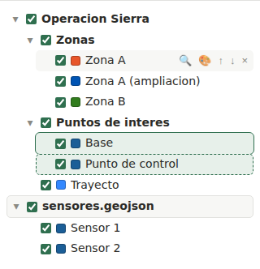
*Figura 8. «Base» y «Punto de control» seleccionadas juntas con `Mayús + clic`. Los cambios de estilo, el borrado o el arrastre se aplican después a las dos a la vez.*

Con una selección múltiple, borrar, arrastrar y cambiar el estilo actúan sobre todas las filas a la vez. Solo la posición de un marcador queda fuera de la edición conjunta, por ser un dato propio de cada uno.

### 3.5 Mover capas de sitio

Arrastrar una fila con el ratón la mueve de carpeta o cambia su orden entre hermanas; una franja de seis píxeles arriba o abajo de cada fila reordena, y soltar sobre el resto de una carpeta mete dentro. `Escape` cancela un arrastre en marcha. También puede recolocarse tecleando: seleccionar la fila, pulsar `Ctrl + X` para cortarla (queda marcada en gris hasta que se pega o se cancela con `Escape`), poner el cursor en el destino y pulsar `Ctrl + V`.

---

## 4. El panel del visor (el mapa)

### 4.1 Mapas base

Un icono de capas, en la esquina superior derecha del mapa, despliega el panel de cartografías de fondo: OpenStreetMap, varias capas del Instituto Geográfico Nacional (mapa base, topográfico, ortofoto PNOA actual e histórica, modelo digital del terreno), un par de opciones de relieve sombreado y, bajo credencial propia del usuario, el modelo de superficie de Copernicus. Se pueden combinar varias a la vez, cada una con su propio control de opacidad, y reordenarse con las flechas de cada fila (el orden de la lista es el orden de apilado en el mapa).

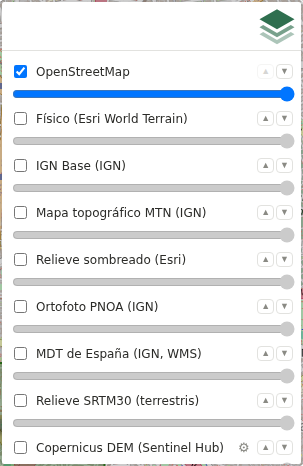
*Figura 9. Panel de mapas base: casilla de activación, control de opacidad y flechas de orden en cada fila. La rueda dentada junto a Copernicus DEM abre su configuración de credencial.*

### 4.2 Barra de herramientas de dibujo y medición

En la esquina superior izquierda del mapa hay dos barras verticales.

La primera reúne las herramientas que dibujan sobre el mapa:

- **Medir línea** (╱): arrastrar de un punto a otro traza una línea y calcula su distancia y su rumbo.
- **Medir círculo** (◯): arrastrar del centro al borde calcula el radio y la superficie.
- **Dibujar polígono o línea** (⬠): un clic por cada vértice; un doble clic sobre el último vértice cierra la figura, y un doble clic fuera de un vértice la deja como una línea abierta.
- **Crear un pin** (📍): añade un marcador en el centro de la vista actual y abre directamente su diálogo de estilo.
- **Exportar PNG** (📷): guarda una imagen del mapa tal como se ve, sin los controles superpuestos, pero con el cuadro de coordenadas, la escala y la atribución (que la licencia de la cartografía exige conservar).

La segunda barra reúne los controles de la propia vista:

- **Autoescalar** (⤢): ajusta el zoom para encuadrar todo lo cargado.
- **IB / GC**: centran la vista en la península y Baleares, o en las islas Canarias.
- **Modo altura** (⛰): activa la consulta de la altitud del terreno (y de la superficie) bajo el cursor, contra los servicios del Instituto Geográfico Nacional; solo tiene cobertura sobre España y necesita conexión. Un segundo botón, junto a él, cambia la unidad de esa lectura entre metros y pies.
- **Paralelos y meridianos** (#): muestra u oculta la retícula geográfica.

### 4.3 Cuadro de coordenadas, escala y atribución

En la esquina inferior izquierda, un cuadro de texto sigue al cursor mostrando la posición en tres notaciones a la vez (grados decimales, grados/minutos/segundos y coordenada UTM con su huso) y el nivel de zoom actual. Con el modo altura activo se le añaden las lecturas de terreno y de superficie, junto con la diferencia entre ambas.

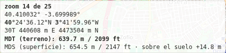
*Figura 10. Cuadro de coordenadas con el modo altura activo: zoom, las tres notaciones de posición y, al final, las lecturas de terreno (MDT) y superficie (MDS) del IGN, con la diferencia entre ambas.*

En la esquina inferior derecha están la escala gráfica y, debajo, la línea de atribución (versión de la aplicación, enlace al repositorio y crédito de la cartografía activa).

---

## 5. El menú contextual del visor

Un clic derecho sobre el mapa abre un menú con las acciones más habituales: copiar las coordenadas del punto, activar el modo altura, las tres herramientas de dibujo, crear un pin, exportar a PNG, y los distintos encuadres y la retícula.

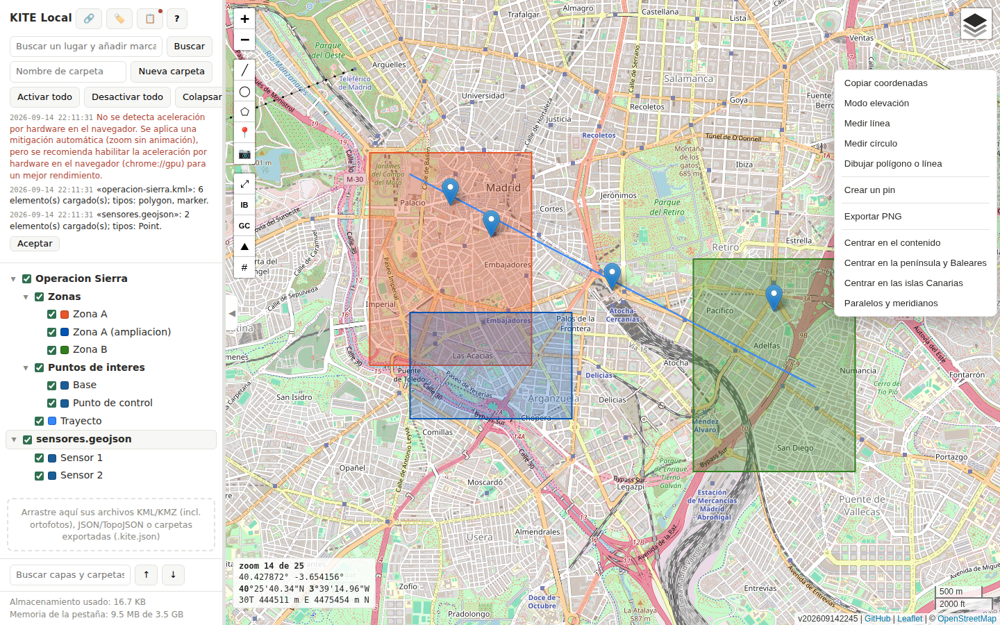
*Figura 11. Menú contextual sobre una zona vacía del mapa.*

Si el clic derecho cae sobre una capa, el menú antepone «Ir al nodo en el panel» (que despliega el árbol hasta esa fila, la selecciona y la hace parpadear en el mapa para identificarla) y, si la capa tiene algo que mostrar, «Mostrar propiedades». Cuando hay varias capas superpuestas exactamente bajo el cursor, esas dos opciones se convierten en un submenú con una entrada por capa, para elegir sobre cuál de todas se quiere actuar.

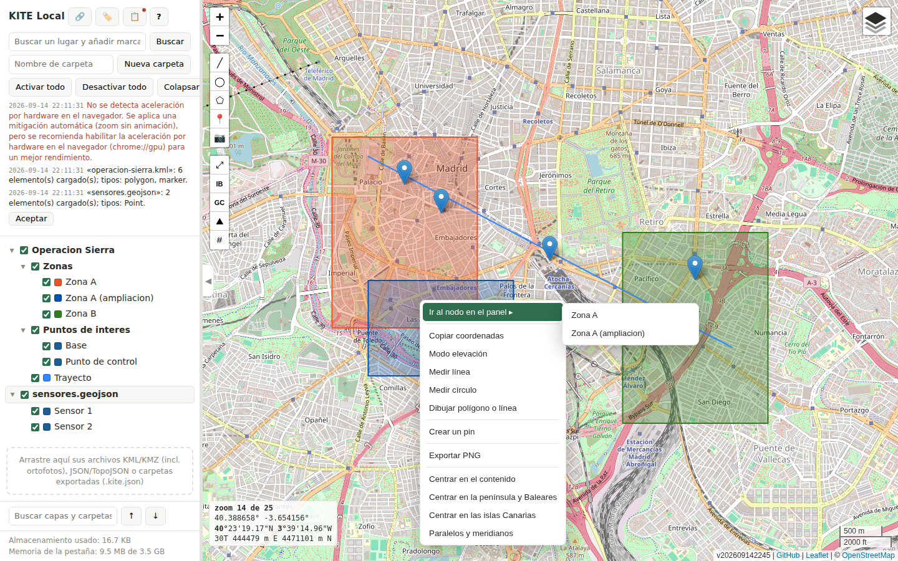
*Figura 12. Con «Zona A» y «Zona A (ampliación)» superpuestas en ese punto, «Ir al nodo en el panel» se convierte en un submenú con una entrada por cada una.*

---

## 6. Estilos de capa

El botón 🎨 de una fila (o de cualquiera de una selección múltiple) abre un diálogo flotante con el estilo de esa capa. El diálogo no aplica nada hasta que se pulsa «Aceptar»; «Cancelar» descarta cualquier cambio probado, incluido un icono distinto. El diálogo se puede arrastrar por su título para apartarlo de la zona del mapa que interese, y no bloquea el resto de la interfaz: se puede seguir trabajando en el mapa mientras está abierto.

### 6.1 Estilo de un marcador

Icono, color y tamaño del marcador; tamaño y color del texto; si el nombre se muestra siempre o solo al pulsar sobre el marcador; y, cuando la capa es un único marcador, su posición exacta, en grados decimales o en grados/minutos/segundos (un botón ⇅ cambia de notación). Mientras el diálogo está abierto, el propio marcador puede arrastrarse por el mapa para ajustar su posición a mano.

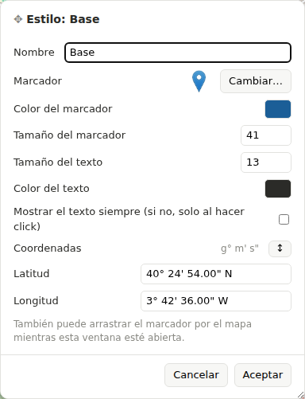
*Figura 13. Estilo de la capa «Base»: icono, color y tamaño del marcador, tamaño y color del texto, y sus coordenadas.*

El botón «Cambiar…» junto al icono abre el catálogo completo de iconos disponibles (banderas, estrellas, círculos numerados, aviación, barco, transporte, figuras geométricas y más), con la gota clásica de Leaflet siempre la primera.

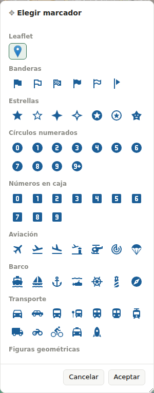
*Figura 14. Catálogo de iconos: la gota clásica al frente y, debajo, las categorías temáticas.*

### 6.2 Estilo de un polígono o una línea

Ancho y color del contorno; un selector de tres opciones —contorno y relleno, solo contorno o solo relleno— en vez de dos casillas sueltas, porque «ni una cosa ni la otra» no es una combinación que tenga sentido ofrecer; color y opacidad del relleno; si el nombre se muestra siempre; y, en modo de solo lectura, el perímetro y el área en la unidad elegida. Un botón «Ver y editar…» abre además la lista completa de vértices como texto (uno por línea, con latitud, longitud y altitud separadas por tabulador), pensada para poder copiarla y pegarla directamente en una hoja de cálculo.

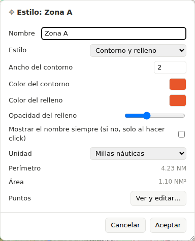
*Figura 15. Estilo de «Zona A»: modo de contorno/relleno, colores, medidas de solo lectura y acceso al editor de vértices.*

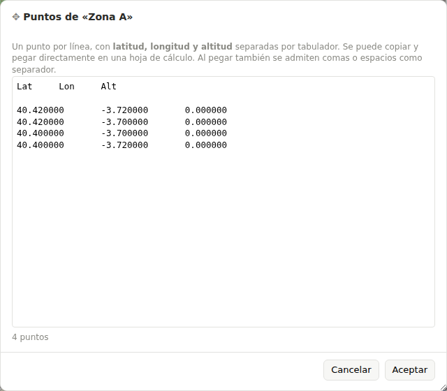
*Figura 16. Lista de vértices de «Zona A», lista para copiarse a una hoja de cálculo.*

Una figura abierta (una línea, no un polígono cerrado) no tiene superficie que rellenar: sus controles de relleno aparecen entonces deshabilitados en vez de ocultos, para que se note que existen pero no aplican a ese caso.

### 6.3 Estilo de una medición

Igual que un polígono en cuanto a trazo y relleno, pero con sus medidas propias en modo de solo lectura: una línea muestra distancia y rumbo; un círculo, radio y área.

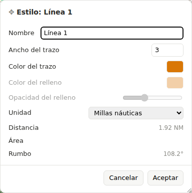
*Figura 17. Estilo de «Línea 1»: mismo tipo de controles que un polígono, con la distancia y el rumbo de la medición debajo.*

### 6.4 Editar varias capas a la vez

Con más de una capa seleccionada, el diálogo de estilos se abre igual, pero con una regla importante: **un valor que no coincide en todas las capas seleccionadas no se aplica a menos que se toque expresamente**. La fila correspondiente se marca como «(varios)» y, al modificar ese control, deja de estarlo y pasa a aplicarse a toda la selección; lo que no se toca se queda exactamente como estaba en cada capa. Esto evita que, por ejemplo, cambiar solo el color de varias capas de golpe termine igualando también sus grosores o sus rellenos sin haberlo pedido.

### 6.5 Ficha de información y propiedades

Cuando una capa procede de un KML con una descripción, o de un GeoJSON con propiedades, el botón ℹ de su fila —o pasar el ratón por encima de la capa en el mapa, o «Mostrar propiedades» del menú contextual— abre una ficha con esa información: el texto original en el caso de un KML (filtrado de cualquier contenido peligroso, conservando el texto) o una tabla de clave y valor en el caso de un GeoJSON.

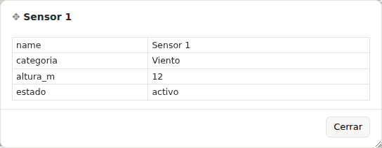
*Figura 18. Propiedades de «Sensor 1», tal como venían en el archivo GeoJSON de origen.*

---

## 7. Cómo hacer las tareas más habituales

### 7.1 Importar un archivo con un polígono (o cualquier otro formato admitido)

La vía más directa es arrastrar el archivo desde el escritorio y soltarlo sobre el panel de navegación (o sobre una carpeta concreta, para que entre dentro de ella). KITE Local reconoce KML, KMZ, GeoJSON, TopoJSON y su propio formato de carpetas exportadas, mirando el contenido del archivo, no su extensión. Si el archivo contiene algún elemento con datos incorrectos, ese elemento se descarta de forma aislada y el resto se carga con normalidad; al terminar aparece siempre un resumen de lo cargado y lo omitido, con la causa.

Cuando no se tiene el archivo en el disco pero sí su dirección web, el botón 🔗 de la cabecera ofrece el mismo resultado en dos pasos: se escribe o se pega la dirección y se pulsa «Descargar»; solo cuando la aplicación confirma qué ha llegado (tipo y tamaño) se activa «Añadir al árbol» para incorporarlo. Mientras no se pulse ese botón, nada llega al mapa.

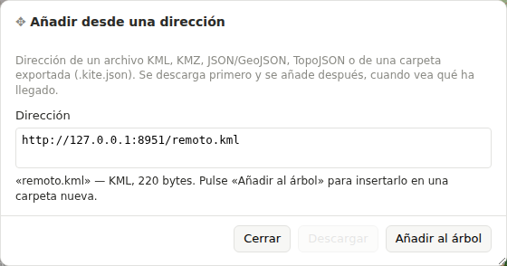
*Figura 19. Tras descargar «remoto.kml», el diálogo confirma el tipo y el tamaño y habilita «Añadir al árbol».*

Todo lo incorporado por esta vía queda dentro de una carpeta «Descargas», con una subcarpeta numerada por descarga («Descarga 1», «Descarga 2»…), para que varias descargas sucesivas no se mezclen entre sí.

### 7.2 Medir una distancia y un rumbo

Se pulsa la herramienta «Medir línea» (╱) de la barra de dibujo, y se arrastra desde el origen hasta el destino sobre el mapa. Al soltar, aparece una etiqueta flotante con la distancia y el rumbo, y la medición queda guardada como una fila más del árbol, dentro de una carpeta «Mediciones», con su propio nombre autonumerado («Línea 1», «Línea 2»…).

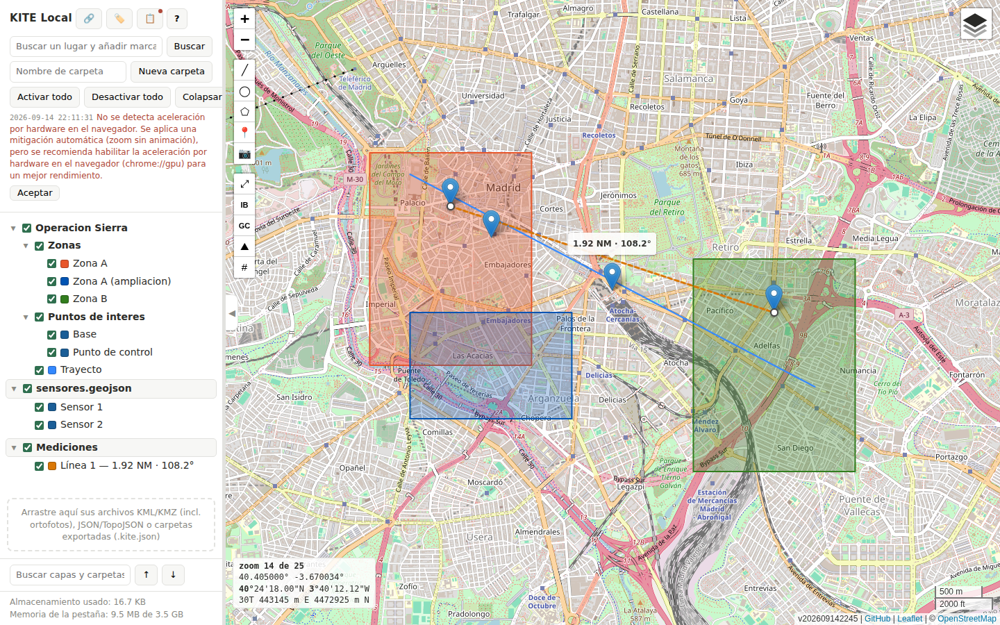
*Figura 20. Medición entre «Base» y «Punto de control»: 1,92 millas náuticas a un rumbo de 108,2°, con su fila correspondiente en el árbol.*

Para editar una medición ya creada basta con mantener pulsado `Ctrl` y arrastrar uno de sus extremos. La unidad de medida (metros, kilómetros, pies o millas náuticas —la unidad por defecto, la habitual en navegación aérea y marítima—) se elige una sola vez y se aplica a la vez a todas las mediciones y a todos los polígonos, tanto en su diálogo de estilo como en las etiquetas que se ven sobre el mapa.

### 7.3 Medir una superficie, o dibujar una figura propia

La herramienta «Medir círculo» (◯) funciona igual que la de línea (arrastrar del centro al borde) y da el radio y la superficie. La herramienta «Dibujar polígono o línea» (⬠) es distinta: no se arrastra, se hace un clic por cada vértice; un doble clic sobre el primer vértice cierra la figura como un polígono con superficie, y un doble clic en cualquier otro punto la deja como una línea abierta, sin relleno.

### 7.4 Personalizar un marcador

Se abre su diálogo de estilo con el botón 🎨 de su fila. «Cambiar…» abre el catálogo de iconos; un clic sobre uno lo selecciona (sin aplicarlo todavía) y «Aceptar», en el selector, lo confirma como icono elegido para ese marcador. De vuelta en el diálogo principal, el color escogido tiñe cualquier icono del catálogo (no afecta a la gota clásica de Leaflet, que es una imagen fija). Solo al pulsar «Aceptar» en el diálogo de estilo se aplica todo el conjunto de cambios —icono, color, tamaños, texto y posición— a la capa.

### 7.5 Copiar capas entre dos instancias distintas de KITE Local

Al ser una aplicación que corre en el navegador, dos pestañas —o dos instalaciones en dos direcciones distintas— no comparten memoria entre sí de forma automática. Para pasar capas de una a otra:

1. En la primera instancia, se selecciona la carpeta o las capas que se quieren llevar (un clic, o `Mayús + clic` para varias) y se pulsa `Ctrl + C`. Esto no solo guarda una copia interna: también escribe la información en el portapapeles del propio sistema operativo.
2. En la segunda instancia —en otra pestaña, otra ventana o incluso otro ordenador con acceso al portapapeles compartido—, se pone el cursor donde se quiera recibir el contenido y se pulsa `Ctrl + V`. La carpeta y sus capas aparecen ahí, con su geometría y sus estilos intactos.

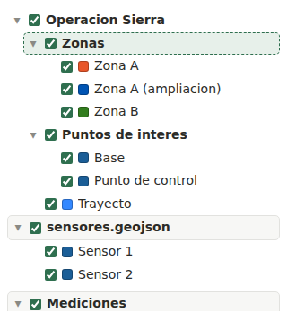
*Figura 21a. Instancia de origen: la carpeta «Zonas» seleccionada justo después de `Ctrl + C`.*

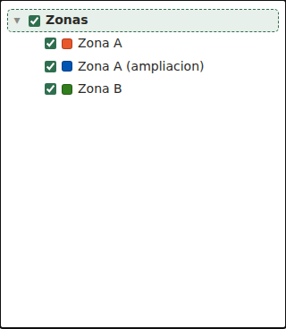
*Figura 21b. Instancia de destino, antes vacía: tras `Ctrl + V`, la carpeta «Zonas» aparece con sus tres capas.*

Este mecanismo copia siempre; nunca mueve nada de la instancia de origen, aunque en esa misma instancia (no entre dos distintas) `Ctrl + X` sí corta de verdad. Pegar solo se interpreta como una importación de capas cuando el cursor está sobre el árbol: pegar en cualquier otro campo de texto de la aplicación —por ejemplo, en el editor de vértices— pega el texto tal cual, sin intentar interpretarlo.

### 7.6 Guardar una carpeta y volver a cargarla más tarde

El botón 💾 de una carpeta o un archivo la descarga entera a un archivo con extensión «.kite.json». Ese archivo puede volver a soltarse sobre el panel —en esta misma instalación o en cualquier otra— y se añade como una copia nueva, nunca sustituye ni fusiona lo que ya hubiera.

### 7.7 Deshacer y rehacer

`Ctrl + Z` deshace la última operación que cambió el árbol (borrar, pegar, arrastrar, ordenar…), y `Ctrl + Y` la rehace. Hacer algo nuevo después de deshacer descarta lo que se pudiera haber rehecho, igual que en cualquier editor de texto.

### 7.8 Consultar la altitud del terreno

Se activa con el botón ⛰ de la barra de vista (o «Modo elevación» del menú contextual). Mientras está encendido, el cuadro de coordenadas añade la altitud del terreno y de la superficie bajo el cursor —dos modelos distintos del Instituto Geográfico Nacional, con cobertura solo sobre España—, y sobre el mapa se va dibujando una cuadrícula con los valores de cada celda consultada, que se acumula mientras el modo sigue activo. Al desactivarlo, lo acumulado en esa sesión queda como una capa más del árbol, dentro de una carpeta «Elevaciones».

---

## 8. Atajos de teclado

La misma tabla está disponible en cualquier momento con la tecla `?` o el botón de ayuda de la cabecera.

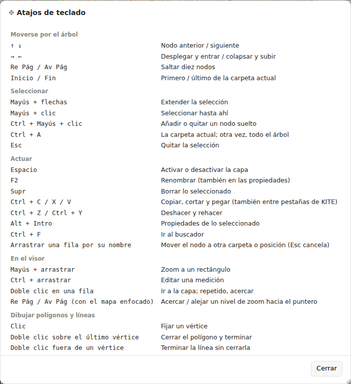
*Figura 22. Chuleta de atajos de teclado (tecla `?`).*

**Moverse por el árbol**

| Tecla | Acción |
|---|---|
| ↑ / ↓ | Nodo anterior / siguiente |
| → / ← | Desplegar y entrar / colapsar y subir |
| Re Pág / Av Pág | Saltar diez nodos |
| Inicio / Fin | Primero / último de la carpeta actual |

**Seleccionar**

| Tecla | Acción |
|---|---|
| Mayús + flechas | Extender la selección |
| Mayús + clic | Seleccionar hasta ahí |
| Ctrl + Mayús + clic | Añadir o quitar un nodo suelto |
| Ctrl + A | La carpeta actual; otra vez, todo el árbol |
| Esc | Quitar la selección |

**Actuar**

| Tecla | Acción |
|---|---|
| Espacio | Activar o desactivar la capa |
| F2 | Renombrar (también desde las propiedades) |
| Supr | Borrar lo seleccionado |
| Ctrl + C / X / V | Copiar, cortar y pegar (también entre pestañas de KITE) |
| Ctrl + Z / Ctrl + Y | Deshacer y rehacer |
| Alt + Intro | Propiedades de lo seleccionado |
| Ctrl + F | Ir al buscador |
| Arrastrar una fila por su nombre | Mover el nodo a otra carpeta o posición (Esc cancela) |

**En el visor**

| Gesto | Acción |
|---|---|
| Mayús + arrastrar | Zoom a un rectángulo |
| Ctrl + arrastrar (sobre una medición) | Editar una medición |
| Doble clic en una capa | Ir a ella; repetido, acercar por peldaños |
| Re Pág / Av Pág (con el mapa enfocado) | Acercar / alejar un nivel de zoom hacia el puntero |

**Dibujar polígonos y líneas**

| Gesto | Acción |
|---|---|
| Clic | Fijar un vértice |
| Doble clic sobre el último vértice | Cerrar el polígono y terminar |
| Doble clic fuera de un vértice | Terminar la línea sin cerrarla |

---

## 9. Qué se guarda y dónde

KITE Local guarda automáticamente, en el propio navegador y en el propio dispositivo (nunca en un servidor), el árbol completo de capas y la posición y el zoom del mapa, con un pequeño retardo tras cada cambio para no repetir el guardado en cada pulsación. Al volver a abrir la aplicación, el árbol y la vista se restauran tal como se dejaron. Este guardado es local a cada navegador: para llevar el mismo contenido a otro dispositivo hace falta exportarlo (apartado 7.6) o copiarlo por el portapapeles del sistema (apartado 7.5).

Algunas preferencias de uso —la unidad de medida elegida, el formato de coordenadas, la unidad de la cuadrícula de elevación— se recuerdan mientras la pestaña sigue abierta, pero no sobreviven a cerrarla: son ajustes de lectura, no parte de los datos cargados.
